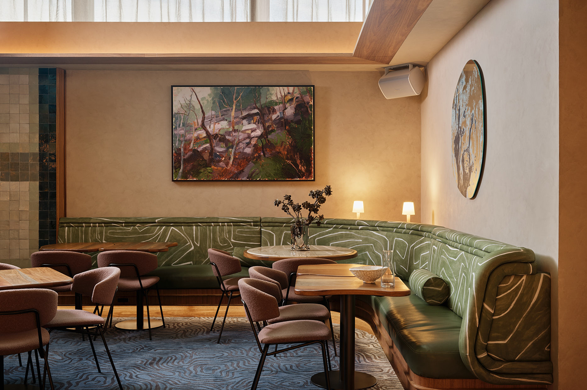

# BLS Website - Blueprint to Reality Effect

## Overview
A scan-line reveal effect for project images that transforms architectural blueprints into finished photos. This effect reinforces the brand story: *"We turn plans into reality."*

---

## Files Modified

### 1. HTML (index.html)
Add `projects__item--blueprint` class and dual images to a project item:

```html
<a href="/project/the-gantry" class="projects__item projects__item--blueprint">
  <div class="projects__item-info">
    <div class="projects__item-meta">
      <span class="projects__item-year">2025</span>
      <span class="projects__item-type">Commercial</span>
    </div>
    <div class="projects__item-title-wrap">
      <h3 class="projects__item-title">The Gantry</h3>
      <h3 class="projects__item-title projects__item-title--hover">The Gantry</h3>
    </div>
  </div>
  <div class="projects__item-visual">
    <div class="projects__item-image-wrap projects__item-image-wrap--blueprint">
      <!-- Reality image underneath -->
      
      <!-- Blueprint image on top -->
      
    </div>
    <span class="projects__item-arrow">→</span>
  </div>
</a>
```

---

### 2. CSS (styles.css)
Add after the existing project image styles:

```css
/* ----------------------------------------
   BLUEPRINT TO REALITY PROJECT EFFECT
   With scan line reveal
   ---------------------------------------- */
.projects__item-image-wrap--blueprint {
  position: relative;
  overflow: hidden;
}

/* Reality image underneath */
.projects__item-image--reality {
  position: relative;
  z-index: 1;
}

/* Blueprint image on top - vertical reveal on hover */
.projects__item-image--blueprint {
  position: absolute;
  top: 0;
  left: 0;
  z-index: 2;
  clip-path: inset(0 0 0 0);
  transition: clip-path 1.2s cubic-bezier(0.16, 1, 0.3, 1), 
              filter 0.3s ease;
}

/* Scan line effect */
.projects__item-image-wrap--blueprint::before {
  content: '';
  position: absolute;
  top: 0;
  left: 0;
  right: 0;
  height: 3px;
  z-index: 10;
  background: linear-gradient(
    90deg,
    transparent 0%,
    rgba(255, 106, 71, 0.3) 10%,
    var(--color-accent) 50%,
    rgba(255, 106, 71, 0.3) 90%,
    transparent 100%
  );
  box-shadow: 
    0 0 20px var(--color-accent),
    0 0 40px var(--color-accent),
    0 0 60px rgba(255, 106, 71, 0.5);
  opacity: 0;
  transform: translateY(0);
  transition: opacity 0.2s ease;
}

/* On hover: activate scan line */
.projects__item--blueprint:hover .projects__item-image-wrap--blueprint::before {
  opacity: 1;
  animation: scanLine 1.2s cubic-bezier(0.16, 1, 0.3, 1) forwards;
}

@keyframes scanLine {
  0% {
    transform: translateY(0);
    opacity: 1;
  }
  90% {
    opacity: 1;
  }
  100% {
    transform: translateY(calc(100% + 200px));
    opacity: 0;
  }
}

/* On hover: reveal from top to bottom */
.projects__item--blueprint:hover .projects__item-image--blueprint {
  clip-path: inset(100% 0 0 0);
  filter: grayscale(100%) brightness(0.5);
}

/* Subtle glow on reality image during scan */
.projects__item--blueprint:hover .projects__item-image--reality {
  animation: realityGlow 1.2s cubic-bezier(0.16, 1, 0.3, 1);
}

@keyframes realityGlow {
  0%, 100% {
    filter: brightness(1);
  }
  50% {
    filter: brightness(1.1);
  }
}

/* Prevent grayscale on blueprint item when list is hovered */
.projects__list:hover .projects__item--blueprint:not(:hover) .projects__item-image--blueprint {
  filter: grayscale(100%);
}

.projects__list:hover .projects__item--blueprint:not(:hover) .projects__item-image--reality {
  filter: grayscale(100%);
}
```

---

## Required Images
- `images/blueprint-hospitality.png` - The architectural blueprint (renamed from Gemini image)
- `images/category-hospitality.png` - The finished/reality photo

---

## Effect Description
1. **Default state:** Blueprint image visible
2. **On hover:**
   - Glowing orange scan line appears at top
   - Scan line sweeps down (1.2s animation)
   - Blueprint fades to greyscale + darkens
   - Blueprint clips away from top revealing reality image
   - Reality image has subtle brightness pulse
3. **On hover out:** Blueprint returns

---

## Customization Options
- **Speed:** Change `1.2s` in transitions and keyframes
- **Scan line color:** Change `var(--color-accent)` to any color
- **Scan line thickness:** Change `height: 3px`
- **Glow intensity:** Adjust `box-shadow` values
- **Direction:** Change `clip-path` values for different reveal directions

---

## Notes
- Effect requires two images per project (blueprint + reality)
- Blueprint images should be generated or designed to match the finished photo
- Can be applied to any/all project items by adding the classes

